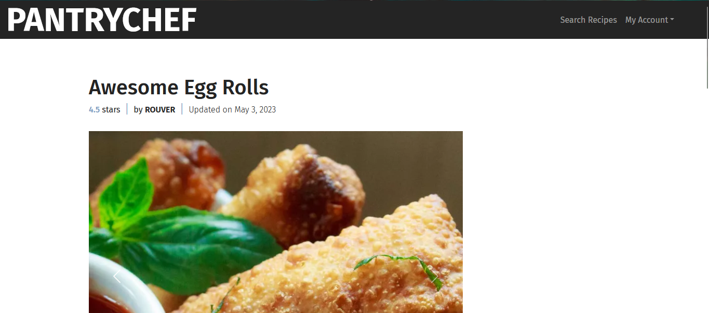
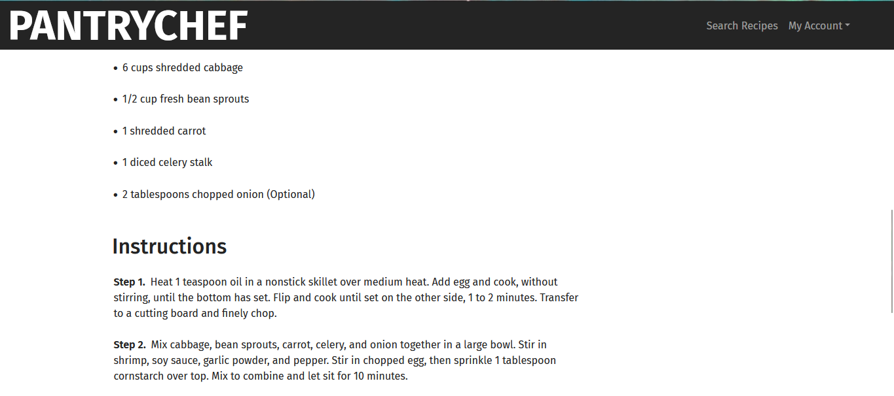

# PantryChef 🍽️

by Steven Knaack
(w/ special thanks to [Neha Talluri](https://github.com/ntalluri) & Joseph Frazier)

## Description 📖

In most kitchens around the world, there are unused ingredients hiding in the corners of
cupboards and chilling in the back of fridges. Most home chefs have faced the challenge of figuring out
what to cook using these leftover ingredients. Most of us end up spending hours scrolling through online
recipes, trying to find a match that aligns with our available ingredients and taste preferences.
Unfortunately, many give up and let these ingredients go to waste – a loss of both money and potential
culinary delights.

To close this gap, we created PantryChef, an easy-to-use program made just for home cooks. Just enter
the ingredients you have on hand, and voila! PantryChef creates a list of potential recipes for you. What's
more, you can get insights from other users' reviews, discover new favorites, and even share your culinary
creations by adding to the database. Under the hood, PantryChef utilizes MySQL for database
management, Java Spring Boot for backend processing, and React.ts to deliver a seamless frontend experience. With PantryChef, we aim to make every ingredient count and help home chefs everywhere turn their
leftovers into delightful dishes.

## Media 🖼️

### Recipe Page




## Installing & Running 🏃‍♀️

### Using Docker Compose (Recommended) 🐋

### Old Fashioned Way 👵

0. Ensure you have [Node.js](https://nodejs.org/en/download/package-manager) downloaded

1. Clone the git repository

```
git clone https://github.com/stevenjknaack/PantryChef.git
```

2. Navigate to the frontend directory and run the following

```
npm run install
npm run dev
```

3. While the frontend is running, navigate to the backend folder and run

```
./gradlew bootRun
```

4. Click this [link](http://localhost:5173/) to access PantryChef

## Helpful Links 🔗

-   [Figma Prototype](https://www.figma.com/design/7kbXP4C4IJvyDLaCC6yYIL/PantryChef?node-id=0-1&t=Wo33CpZHMntnxIbv-1)

-   [Recipe and Review Dataset](https://www.kaggle.com/datasets/irkaal/foodcom-recipes-and-reviews?resource=download&select=reviews.csv)
